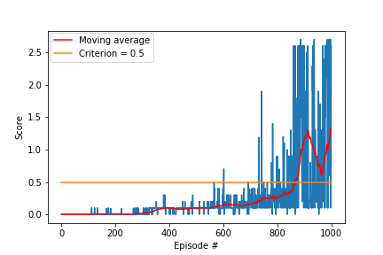

# Conclusion and Outlook
In this article, I discuss the training result of the implemented **Continous Control for the Reacher Environment**.  
I solved the given problem with the DDPG algorithm since DDPG works very well in continuous action space.

## Learning Algorithm

#### - Actor
The actor was initialized:
* Fully connected - inputState -> 128 -> 128 -> actionSize
* ReLu Activation Function 
* first Layer with - BatchNorm1d(x)
* Adam Optimzer was used to caluclate loss

#### - Critic
*Build a critic (value) network that maps (state, action) pairs -> Q-values.*  
The critic was initialized;
* Fully connected - 128 -> 128 -> Q-Value
* ReLu Activation Function 
* first Layer with - BatchNorm1d(x)
* Adam Optimzer was used to caluclate loss

### Deep Deterministic Policy Gradient (DDPG)
In contrast to other Actor-Critic methods, the critic in DDPG is used to approximate the maximizer over the Q-values of the next state.  
This is actually differnet to classic Actor-Crtitic approaches. DDPG is preferably used in continuous action spaces.    
* The actor tries to learn the best action argmaxa( Q(s,a) )  
* The critic learns to evaluate the optimal action-value function by using the actor's best believed action.

Update policy and value parameters   
* Qtargets = reward + &gamma; &middot; critictarget(snext, actortarget(snext))  
* Qexpected = criticlocal(s, actions)  
* criticloss = torch.nn.functional.mse_loss( Qexpected, Qtargets )
        
#### Soft-Target Update 
Soft-Update was used to update target network in each step with a update rate &tau;  
&Theta;target = &tau; &middot; &Theta;local + (1 - &tau;) &middot; &Theta;local

#### Experience Replay
Fixed-size buffer to store experience tuples and use them again for training. This can break correlations.

## Hyperparameters
* Replay Buffer size - BUFFER_SIZE = int(1e5)
* Minibatch size - BATCH_SIZE = 128
* Discount factor - &gamma; = 0.99 
* For soft update target parameters - &tau; = 1e-2
* actor learning rate - lr = 2e-4 
* critic learning rate - lr = 2e-4
* weight decay = 0  

## Results
* [version 1]
The required criterion of an average of 30 points (averaged over 100 episode) was achieved in round about 300 episodes.

## Outlook
How the agent can be improved:
* Priorized Experience Replay
* Playing around with the parameters
* Use PPO
* Use version_2 (20 agents) to train simultaneously
